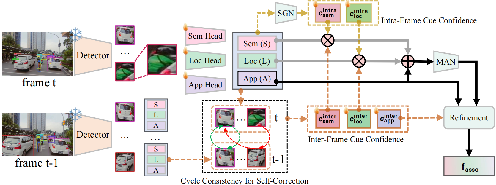
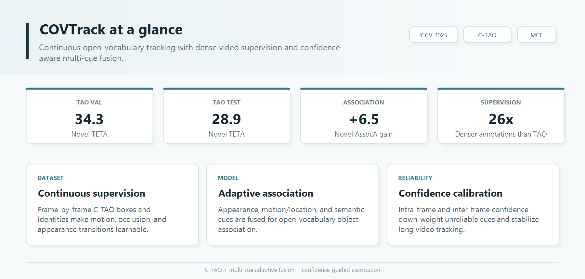
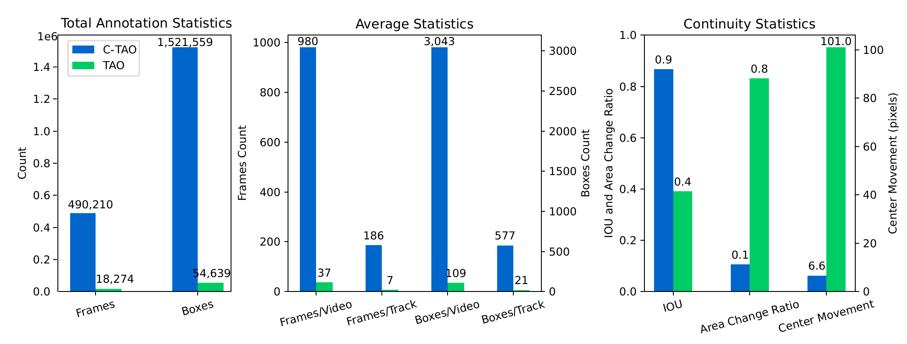
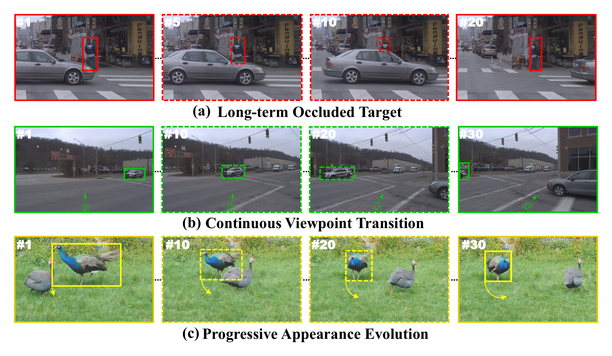

<div align="center">

<h1>COVTrack: Continuous Open-Vocabulary Tracking via Adaptive Multi-Cue Fusion</h1>

<p>
  <b>ICCV 2025</b> &nbsp; | &nbsp;
  Open-Vocabulary Multi-Object Tracking &nbsp; | &nbsp;
  C-TAO Continuous Video Supervision
</p>

<p>
  <a href="https://github.com/zekunqian/COVTrack"></a>
  <a href="https://huggingface.co/clarkqian/COVTrack"></a>
  
  
</p>

<p>
  <a href="#highlights">Highlights</a> /
  <a href="#c-tao">C-TAO</a> /
  <a href="#dataset">Dataset</a> /
  <a href="#method">Method</a> /
  <a href="#results">Results</a> /
  <a href="#quick-start">Quick Start</a> /
  <a href="#citation">Citation</a>
</p>

</div>

<p align="center">
  
  <br>
  <sub>Adaptive multi-cue fusion for continuous open-vocabulary multi-object tracking.</sub>
</p>

## Highlights

COVTrack studies **open-vocabulary multi-object tracking (OVMOT)**, where a tracker must localize, classify, and associate both base and novel object categories in unconstrained videos. The project couples a continuous video training set, **C-TAO**, with a confidence-aware **multi-cue adaptive fusion** framework.

<p align="center">
  
</p>

## C-TAO

TAO is category-rich but sparsely annotated. C-TAO preserves TAO's videos, categories, and trajectories while completing missing frame-level annotations. This gives OVMOT models realistic temporal supervision for occlusion, viewpoint change, deformation, and fast motion.

<p align="center">
  
</p>

C-TAO contains **490,210** annotated frames and **1,521,559** boxes, with about **980** frames per video and **186** frames per track.

<p align="center">
  
</p>

## Dataset

The environment and base OVTrack setup follow [OVTrack INSTALL.md](https://github.com/SysCV/ovtrack/blob/main/docs/INSTALL.md). The raw TAO/LVIS data keeps the standard OVTrack layout under `data/`. C-TAO only provides the continuous training annotation on top of the original TAO frames.

```text
data/
  tao/
    frames/
      train/
      val/
      test/
    annotations/
      validation_ours.json
      validation_ours_v1.json
  lvis/
    annotations/
      lvis_classes_v1.txt
saved_models/
  ctao_dataset/
    ctao_base.json              # C-TAO training annotation
  pretrained_models/
    detpro_prompt.pt
    ovtrack_pair.pth
  ovtrack/
    ovtrack_vanilla_clip_prompt.pth
```

The C-TAO config uses:

```text
frames       data/tao/frames/
train ann    saved_models/ctao_dataset/ctao_base.json
val/test ann data/tao/annotations/validation_ours_v1.json
class names  data/lvis/annotations/lvis_classes_v1.txt
```

If `validation_ours_v1.json` has not been generated yet, run:

```bash
python tools/convert_datasets/tao2coco.py -t ./data/tao/annotations/
python tools/convert_datasets/create_tao_v1.py data/tao/annotations/validation_ours.json
```

## Method

COVTrack builds an association representation from complementary object cues and learns how much each cue should contribute under changing video conditions.

- **Appearance cue:** separates object instances visually across frames.
- **Motion/location cue:** models temporal and geometric continuity from dense C-TAO supervision.
- **Semantic cue:** adds category-aware context for base and novel objects.
- **Intra-frame confidence:** estimates cue reliability within each frame before association.
- **Inter-frame confidence:** refines cue consistency across adjacent frames through self-correction.

Core implementation files:

```text
ovtrack/models/roi_heads/ovtrack_roi_head.py
ovtrack/models/trackers/ovtracker.py
configs/uncertainty-ovtrack-teta/ovtrack_r50_ctao_train.py
```

## Results

### TAO Open-Vocabulary MOT

All methods use ResNet-50. COVTrack is reported as `Ours` in the ICCV 2025 paper.

| Method | Split | Novel TETA | Novel LocA | Novel AssocA | Base TETA | Base LocA | Base AssocA |
| --- | --- | ---: | ---: | ---: | ---: | ---: | ---: |
| OVTrack | Val | 27.8 | 48.8 | 33.6 | 35.5 | 49.3 | 36.9 |
| SLAck | Val | 31.1 | 54.3 | 37.8 | 37.2 | 55.0 | 37.6 |
| **COVTrack** | Val | **34.3** | **58.2** | **41.3** | **39.6** | **57.3** | **42.0** |
| OVTrack | Test | 24.1 | 41.8 | 28.7 | 32.6 | 45.6 | 35.4 |
| SLAck | Test | 27.1 | 49.1 | 30.0 | 34.7 | 52.5 | 35.6 |
| **COVTrack** | Test | **28.9** | **50.9** | **32.6** | **37.9** | **54.5** | **42.1** |

## Quick Start

### 1. Environment

See [docs/INSTALL.md](docs/INSTALL.md) and [docs/GET_STARTED.md](docs/GET_STARTED.md) for the full setup.

```bash
pip install -r requirements.txt
pip install -v -e .
```

### 2. Prepare Dataset

Prepare TAO/LVIS and place the C-TAO annotation JSON, prompts, and pretrained weights according to the [Dataset](#dataset) section.

### 3. Train

The paper-style C-TAO experiment entry is `run_later.py`. This is the authoritative command:

```bash
python run_later.py
```

Internally, `run_later.py` expands the training call as the following command pattern. `TRAIN_PORT` is randomly sampled in the script from `[20001, 29999]`.

```bash
CUDA_VISIBLE_DEVICES=0,1,2,3 \
tools/dist_train.sh \
  configs/uncertainty-ovtrack-teta/ovtrack_r50_ctao_train.py \
  4 ${TRAIN_PORT} \
  --work-dir work_dirs/VOVTrack_after/c_tao_training_tidy \
  --cfg-options \
  model.roi_head.feature_fusion_head.max_fusion_ratio=2.0 \
  data.train.dataset.dataset.extra_sample_ratio=8 \
  model.roi_head.cyc_loss_start_iteration=1000 \
  total_epochs=20 \
  data.train.dataset.dataset.ref_img_sampler.scope=30 \
  model.roi_head.use_cyc_loss=False
```

This command starts from `saved_models/pretrained_models/ovtrack_pair.pth`, reads the DetPro prompt from `saved_models/pretrained_models/detpro_prompt.pt`, and trains with `saved_models/ctao_dataset/ctao_base.json`, as specified in `configs/uncertainty-ovtrack-teta/ovtrack_r50_ctao_train.py`.

### 4. Evaluate

`run_later.py` evaluates checkpoints from the training work directory with `split_num = 2`. It sorts `epoch_*.pth` files, splits the checkpoint indices into two ranges, and launches two `dist_test.sh` commands in parallel. `TEST_PORT` is randomly sampled from `[30001, 49999]`; `L_INDEX` and `R_INDEX` are generated from the runtime checkpoint split.

```bash
CUDA_VISIBLE_DEVICES=0,1,2,3 \
tools/dist_test.sh \
  configs/uncertainty-ovtrack-teta/ovtrack_r50_ctao_train.py \
  work_dirs/VOVTrack_after/c_tao_training_tidy/epoch_1.pth \
  4 ${TEST_PORT} \
  --eval track \
  --eval-options resfile_path=results/debug3 \
  --checkpoint-dir work_dirs/VOVTrack_after/c_tao_training_tidy \
  --checkpoint-l-index ${L_INDEX} \
  --checkpoint-r-index ${R_INDEX} \
  --cfg-options \
  model.tracker.match_score_thr=0.37 \
  model.test_cfg.rcnn.max_per_img=80 \
  model.roi_head.feature_fusion_head.max_fusion_ratio=2.0 \
  model.tracker.confused_features=True \
  model.roi_head.only_validation_categories=True \
  model.tracker.memo_frames=50 \
  model.tracker.momentum_embed=0.4
```

The explicit `epoch_1.pth` argument is required by `tools/test.py`; when `--checkpoint-dir` is provided, the script iterates over the selected `epoch_*.pth` files inside that directory and writes per-epoch results under `results/debug3/epoch_*`.

### 5. Custom Videos

Edit custom class prompts in `ovtrack/models/roi_heads/class_name.py`, then run:

```bash
python tools/inference.py \
  configs/ovtrack-custom/ovtrack_r50.py \
  saved_models/ovtrack/ovtrack_vanilla_clip_prompt.pth \
  --video YOUR_VIDEO.mp4 \
  --out_frame_dir YOUR_OUTPUT_FRAMES_DIR \
  --out_video_dir YOUR_OUTPUT_VIDEOS_DIR \
  --thickness 1
```

## Repository Layout

```text
configs/
  uncertainty-ovtrack-teta/   COVTrack C-TAO training and evaluation configs
  ovtrack-custom/             Custom-video inference config
docs/                         Installation notes and README figures
ovtrack/
  models/roi_heads/           Open-vocabulary detection and multi-cue fusion
  models/trackers/            Online association and tracking logic
  datasets/                   TAO/BDD/video dataset wrappers
tools/                        Training, testing, conversion, and inference scripts
```

## Acknowledgements

This codebase builds on [OVTrack](https://github.com/SysCV/ovtrack), [MMDetection](https://github.com/open-mmlab/mmdetection), [CLIP](https://github.com/openai/CLIP), [DetPro](https://github.com/dyabel/detpro), [TAO](https://github.com/TAO-Dataset/tao), and [TETA](https://github.com/SysCV/tet/tree/main/teta).

## Citation

```bibtex
@InProceedings{Qian_2025_ICCV,
  author = {Qian, Zekun and Han, Ruize and Wang, Zhixiang and Hou, Junhui and Feng, Wei},
  title = {COVTrack: Continuous Open-Vocabulary Tracking via Adaptive Multi-Cue Fusion},
  booktitle = {Proceedings of the IEEE/CVF International Conference on Computer Vision (ICCV)},
  month = {October},
  year = {2025},
  pages = {10054-10063}
}
```
